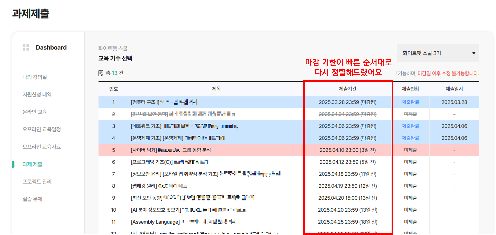
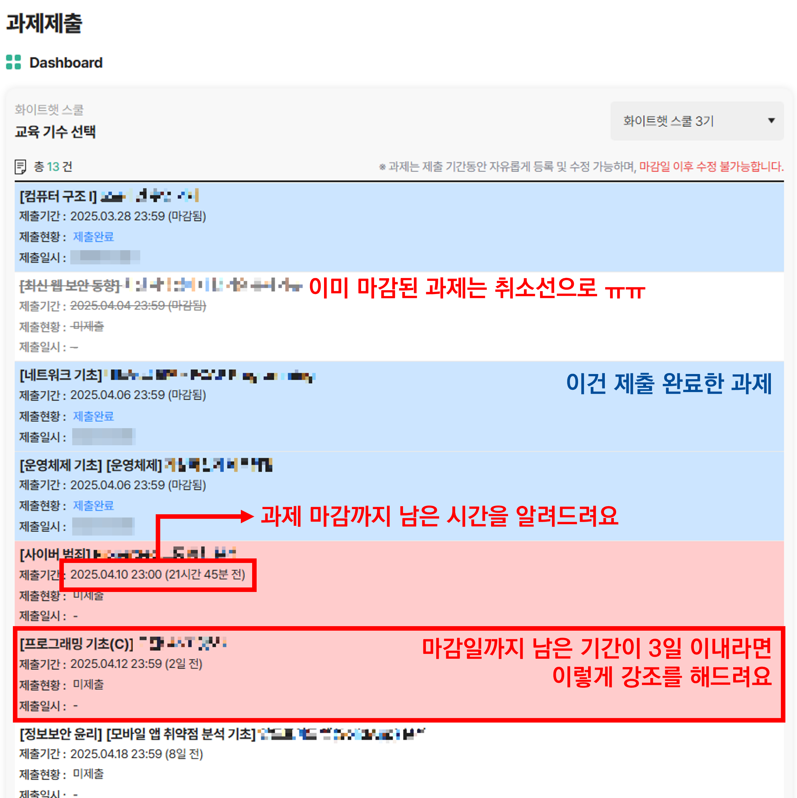
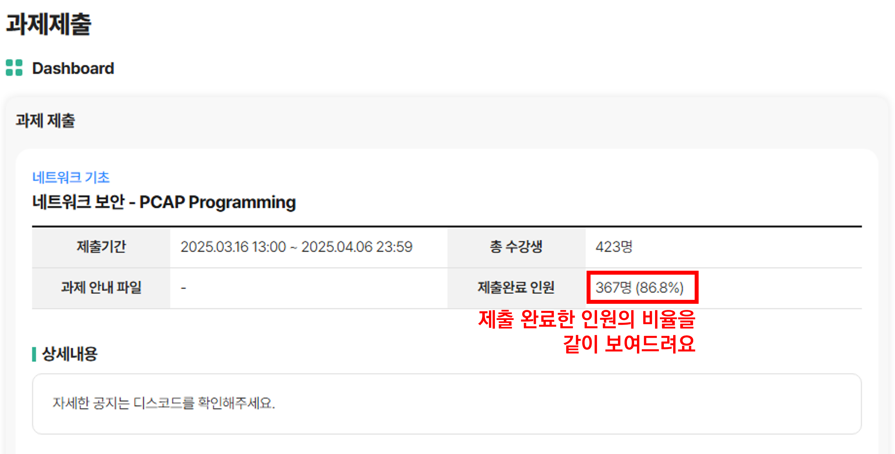
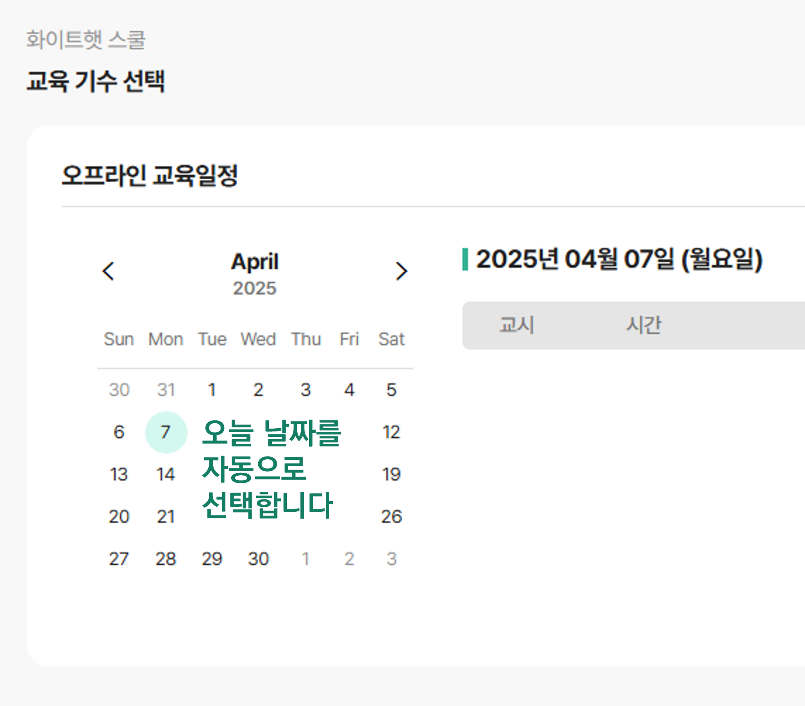

# WHS Helper Extension
KITRI 화이트햇 스쿨(WHS) 웹 사이트의 UX를 개선하기 위한 Chrome/Chromium 브라우저용 확장 프로그램입니다.

## 주요 기능
### 과제 목록 정렬
* 과제 목록을 제출 마감일 기준으로 오름차순 정렬합니다.
* 제출 마감 기한까지 남은 시간을 일/시간/분 단위로 표시합니다.
    * 24시간 이상 남은 경우, '일' 단위로 표시합니다.
    * 24시간 미만 남은 경우, '시간'과 '분' 단위로 표시합니다.
* 제출 상태 별로 배경 색을 변경하여 강조합니다.
    * 제출 완료한 경우, 파란색 배경으로 변경
    * 마감 기한이 경과했으나 제출하지 않은 경우, 취소선과 회색 글씨로 변경
    * 마감이 임박한 경우(3일 이내), 빨간색 배경

### 과제 제출 비율 표시
* 과제 상세 페이지에서 총 수강생 대비 해당 과제를 제출 완료한 교육생의 비율을 계산하여 표시합니다.

### 오늘 날짜 자동 선택
* '오프라인 교육일정' 메뉴에서 오늘 날짜를 자동으로 선택하는 기능을 추가했습니다.
  * 매번 오늘 날짜를 달력에서 찾아 수동으로 눌러야 하는 게 불편했어요.

 
## 설치 방법
1. 이 Git Repository를 Clone 하거나 [Release](https://github.com/ssogari-dev/whs-helper/releases/tag/release)에서 압축된 파일을 다운로드합니다.
2. Chrome/Chromium 브라우저에서 `chrome://extensions`로 이동 후 **개발자 모드**를 활성화합니다.
3. '**압축 해제된 확장 프로그램 로드**' 또는 '**압축 풀린 파일 로드**'를 클릭하여 Clone된 Repository 또는 압축해제한 디렉터리를 선택합니다.
4. 확장 프로그램 목록에 WHS Helper가 표시되면 사용 가능합니다.

## 개발자 및 기여
* **개발자** 화이트햇 스쿨 3기 23반 황보현
* **기여** 자유롭게 Github Issue, PR 또는 메일(admin at ssogari dot dev)로 남겨주세요

_Copyleft 🄯 쏘가리스튜디오_
